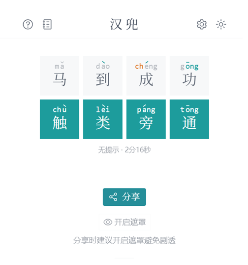

# handle-solver

**[汉兜 (handle.antfu.me)](https://handle.antfu.me/)** 是 Wordle 的中文版——你有十次机会猜一个四字成语，每次猜测后拼音的颜色（灰/黄/绿）会提示你离答案有多近。

本工具自动筛选候选词，帮你更快解题。

## 使用

> **https://jimbozhang.github.io/handle-solver/**

操作：输入猜的成语 → 点击拼音方块切换颜色（灰/黄/绿）→ 筛选候选词。

## 词库

来自 [pwxcoo/chinese-xinhua](https://github.com/pwxcoo/chinese-xinhua)，已修正部分标注错误。
